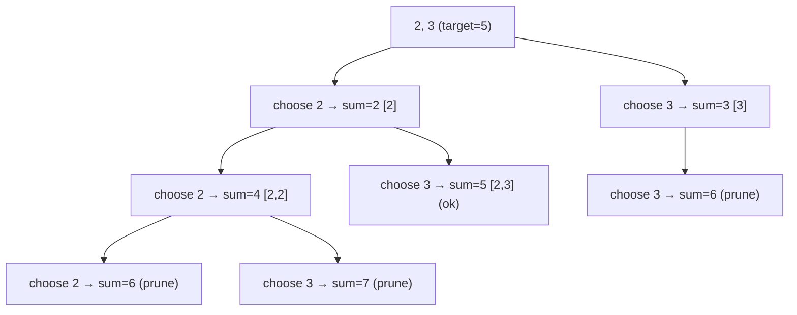

# 39. Combination Sum

Date: Feb 23
Level: Medium
Minutes: 35
Review Recommendation: ✅ Good job
Status: Done
Tags: Backtracking
Time Complexity: O(n^(T/m))
Space Complexity: O(T / m)
URL: https://leetcode.com/problems/combination-sum/description/
Carl's: https://programmercarl.com/0039.%E7%BB%84%E5%90%88%E6%80%BB%E5%92%8C.html#%E6%80%9D%E8%B7%AF

<aside>
💡

Given an array of **distinct** integers `candidates` and a target integer `target`, return *a list of all **unique combinations** of* `candidates` *where the chosen numbers sum to* `target`*.* You may return the combinations in **any order**.

The **same** number may be chosen from `candidates` an **unlimited number of times**. Two combinations are unique if the frequency of at least one of the chosen numbers is different.

The test cases are generated such that the number of unique combinations that sum up to `target` is less than `150` combinations for the given input.

</aside>

# Thought

- How to **trim** is the key to be efficient:
    - At each node, only take the the rest of candidate(including self) as its children
    - Why? candidates before current node has already checked the case that contains current node.
- Recurison Design: (backtracking template)
    - return void, take extra sum, index(virtual cut candidates array)
    - base case: sum bigger than target → return; sum equal target → add path to res list. (path and res are global)
    - steps: for rest of the candidates, do recursion, backtrack sum and path.
- Recursion tree:



# Solution

## Raw

```java
class Solution {
    public List<List<Integer>> combinationSum(int[] candidates, int target) {
        List<List<Integer>> res = new ArrayList<>();
        backtracking(candidates, target, 0, new ArrayDeque<Integer>(), res);
        return res;
    }

    private void backtracking(int[] candidates, int target, int sum, Deque<Integer> path, List<List<Integer>> res) {
        if (sum > target) { 
            return;
        }

        if (sum == target) {
            List<Integer> temp = new ArrayList(path);
            Collections.sort(temp);
            boolean contain = false;

            for (List<Integer> l : res) {
                if (l.equals(temp)) {
                    contain = true;
                }
            }

            if (!contain) {
                res.add(temp);
            }
            
            return;
        }

        for (int num : candidates) {    
            sum += num;
            path.push(num);

            backtracking(candidates, target, sum, path, res);

            sum -= num;
            path.pop();
        }
    }
}
```

## Trimmed

```java
class Solution {
    List<List<Integer>> res = new ArrayList<>();
    Deque<Integer> path = new ArrayDeque<>();

    public List<List<Integer>> combinationSum(int[] candidates, int target) {
        backtracking(candidates, target, 0, 0);
        return res;
    }

    private void backtracking(int[] candidates, int target, int sum, int index) {
        if (sum > target) { 
            return;
        }

        if (sum == target) {
            List<Integer> temp = new ArrayList(path);
            res.add(temp);        
            return;
        }

        for (int i = index; i < candidates.length; i++) { // only check the rest of candidates
            int num = candidates[i];
            sum += num;
            path.push(num);

            backtracking(candidates, target, sum, i);

            sum -= num;
            path.pop();
        }
    }
}
```

## Carl’s

```java
// 剪枝优化
class Solution {
    public List<List<Integer>> combinationSum(int[] candidates, int target) {
        List<List<Integer>> res = new ArrayList<>();
        Arrays.sort(candidates); // 先进行排序
        backtracking(res, new ArrayList<>(), candidates, target, 0, 0);
        return res;
    }

    public void backtracking(List<List<Integer>> res, List<Integer> path, int[] candidates, int target, int sum, int idx) {
        // 找到了数字和为 target 的组合
        if (sum == target) {
            res.add(new ArrayList<>(path));
            return;
        }

        for (int i = idx; i < candidates.length; i++) {
            // 如果 sum + candidates[i] > target 就终止遍历
            if (sum + candidates[i] > target) break;
            path.add(candidates[i]);
            backtracking(res, path, candidates, target, sum + candidates[i], i);
            path.remove(path.size() - 1); // 回溯，移除路径 path 最后一个元素
        }
    }
}
```